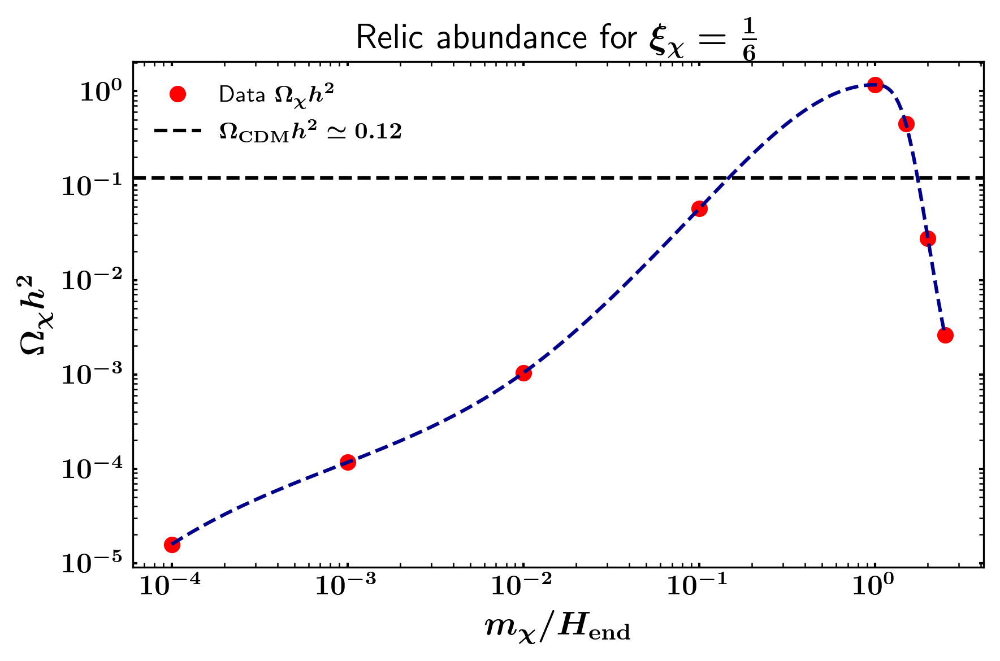
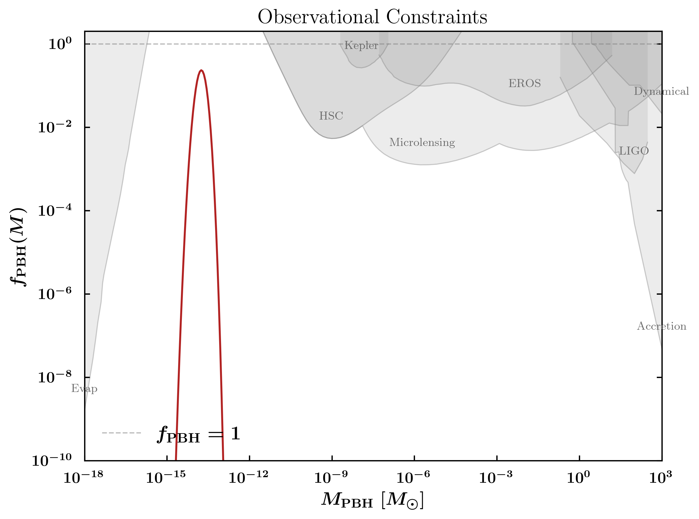
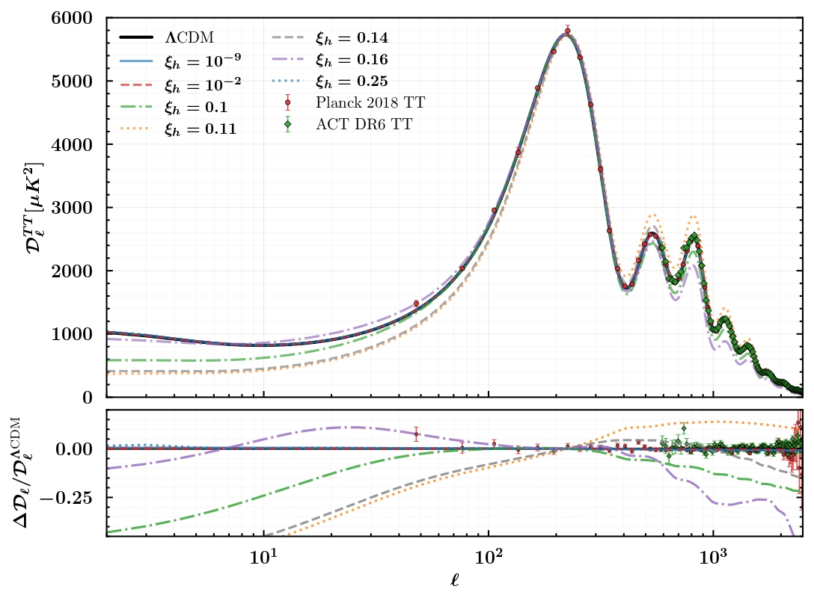

```{=html}
<p class="research-subtitle">Early Universe Cosmology &amp; High-Energy Physics</p>
```

---

::: {.project-item}
::: {.project-grid}
::: {.project-text}
<span class="project-number">01</span>

### Cosmological Collider Physics & EFT of Inflation

Employing the Effective Field Theory (EFT) of Inflation framework to study heavy particle production. We analyze how massive fields $\sigma$ leave distinct non-Gaussiam signatures in the primordial bispectrum $\mathcal{B}_\zeta(k_1\,,k_2\,,k_3)$, acting as a cosmological particle collider at energy scales up to $H\sim 10^{14}\,\text{GeV}$.

::: {.project-tags}
[EFT of inflation]{.tag} [Non-Gaussianities]{.tag} [Cosmological Collider]{.tag}
:::
:::
:::
:::

::: {.project-item}
::: {.project-grid}
::: {.project-text}
<span class="project-number">02</span>

### Gravitational Particle Production in the Early Universe

Investigating non-perturbative particle production induced purely by time-dependent gravitational backgrounds during and after inflation. We study the evolution of the phase space distribution $n_k(t)$ for scalar, fermion, and vector fields, evaluating their contribution to dark matter candidates and primordial relics during preheating.

::: {.project-tags}
[Gravitational production]{.tag} [QFT in Curved Spacetime]{.tag} [In Progress]{.tag .tag-active}
:::
:::
::: {.project-image}
{width="100%"}
:::
:::
:::

::: {.project-item}
::: {.project-grid}
::: {.project-text}
<span class="project-number">03</span>

### Primordial Black Holes & Induced Gravitational Waves

Using Brownian motion and stochastic formalism in the early Universe to analyze primordial black hole formation from enhanced curvature perturbations and their induced gravitational wave background.

::: {.project-tags}
[PBHs]{.tag} [Gravitational Waves]{.tag} [In Progress]{.tag .tag-active}
:::
:::
::: {.project-image}
{width="100%"}
:::
:::
:::

::: {.project-item}
::: {.project-grid}
::: {.project-text}
<span class="project-number">04</span>

### Multifield inflationary models

Investigating non-trivial field space dynamics and quantum field theory effects during inflation with multiple scalar fields. We explore turned trajectories, mass hierarchies, and the generation of isocurvature perturbations, evaluating their impact on primordial non-Gaussianities and observational constraints from CMB data on the tensor-to-scalar ratio $r$.

::: {.project-tags}
[Inflation]{.tag} [Higgs]{.tag} [Observational Constraints]{.tag}
:::
:::
::: {.project-image}
{width="100%"}
:::
:::
:::